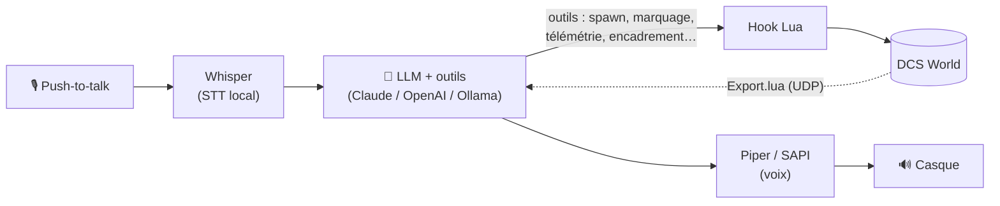

<div align="center">

# 🎙️ Claude Copilot for DCS

**Un copilote vocal intelligent pour [DCS World](https://www.digitalcombatsimulator.com/) —
parle à ton équipage, il agit dans la mission.**

*Reconnaissance vocale locale · IA à outils (Claude / OpenAI / Ollama) · voix neuronale ·
multi-personas (opérateur, AWACS, ailier) · spawn & contrôle en jeu — le tout sans mod lourd
ni modification de `MissionScripting.lua`.*

**par Snurpsss & Claude**

📖 **[Guide détaillé →](GUIDE.md)** · [Installation](#-installation) · [Fonctionnalités](#-fonctionnalités)

</div>

---

## ✨ En bref

Tu **parles** (push-to-talk, casque VR compatible), et un copilote IA t'écoute, te répond de
vive voix, et **agit dans ta mission** DCS : il te donne ta position, fait apparaître des unités,
encadre une commande du cockpit pour t'aider, marque une cible… Plusieurs **personas** cohabitent,
chacun avec sa **voix**, son **indicatif**, sa **langue** et son **rôle** — appelle-les par la radio.

Tout ce qui peut l'être tourne **en local** : la reconnaissance vocale (Whisper) et la synthèse
(Piper) sont sur ta machine ; seul le « cerveau » (le LLM) est appelé via une API — et il est
**interchangeable** (Claude, OpenAI, ou **Ollama** 100 % hors-ligne).



---

## 🚀 Fonctionnalités

| Domaine | Ce que le copilote sait faire |
|---|---|
| **Infos de vol** | Position, altitude, cap, vitesse, point de situation (unités aéro : pieds, nœuds, cap 3 chiffres) |
| **Opérateur / spawn** | Faire apparaître **avions, unités au sol, navires** ; **paquets tactiques** (site SA‑10, colonne blindée, CAP de 4, groupe naval…) ; **objets statiques** (dépôt, FARP, entrepôt) |
| **Positionnement** | « devant moi / à mon 3 heures », « au sud de \<ville\> », « près de \<aérodrome\> », « au bullseye », **« à mon repère F10 »**, ou coordonnées — avec **accrochage terrain** (jamais un char dans l'eau) |
| **Missions IA** | Ravitailleur & AWACS **contactables au menu radio**, patrouilles CAP, ordre **« fais tirer mes alliés »** |
| **Instructeur** | **Encadre une commande du cockpit** (comme les missions d'entraînement DCS) et guide les procédures (démarrage, décollage, atterrissage) |
| **AWACS** | Marquage de cible (fumigène / fusée / cercle sur la carte F10) |
| **Affichage** | Les réponses s'affichent aussi **à l'écran** dans DCS |
| **Multi-personas** | Plusieurs opérateurs simultanés — **voix + indicatif + langue + fréquence** propres ; adressage par **indicatif**, **bouton PTT dédié** ou **fréquence radio** (F/A‑18C) |
| **Voix** | Piper (neuronal, local, multilingue — catalogue téléchargeable) ou SAPI ; sortie vers ton casque, ou **radio en jeu via DCS‑SRS** |
| **Cerveau interchangeable** | Anthropic (Claude), OpenAI, ou **Ollama** (local) — un réglage suffit |

---

## 🧩 Prérequis

- **Windows** + **DCS World**
- Un **microphone** (casque VR OK)
- Une **clé API** d'un fournisseur d'IA (Anthropic par défaut, ou OpenAI) — **ou** [Ollama](https://ollama.com) pour du 100 % local
- Une connexion internet **au premier démarrage** (téléchargement automatique des composants)

> Pas besoin de Python installé ni de toucher à `MissionScripting.lua`.

---

## 📥 Installation

### 1. Récupérer le projet
Télécharge/clone ce dépôt dans un dossier, par ex. `D:\DCSClaude`.

### 2. Côté DCS (une fois)
**a. Télémétrie** — copie `dcs_claude_export.lua` dans :
```
%USERPROFILE%\Saved Games\DCS\Scripts\dcs_claude_export.lua
```
puis ajoute **à la fin** de ton `Export.lua` (même dossier `Scripts\`, crée-le si besoin) :
```lua
dofile(lfs.writedir()..[[Scripts\dcs_claude_export.lua]])
```

**b. Actions en jeu** — copie `dcs_claude_control.lua` dans :
```
%USERPROFILE%\Saved Games\DCS\Scripts\Hooks\dcs_claude_control.lua
```

> Aucun mod, aucune modification de `MissionScripting.lua`. Le hook chaîne proprement les autres
> outils (SRS, Tacview…).

### 3. Lancer
Double‑clique **`run.bat`**. **Au premier démarrage**, il télécharge et installe automatiquement
tout ce qu'il faut (Python embarqué, librairies, Piper + une voix) — compte quelques minutes.
L'interface web s'ouvre ensuite toute seule.

### 4. Clé API
Dans l'interface, carte **« Cerveau (IA) »**, colle ta clé API (stockée localement, affichée masquée).
Tant qu'aucune clé n'est fournie, le copilote **attend**. *(Ollama ne demande pas de clé.)*

### 5. En vol
Ouvre une mission, prends les commandes d'un avion, **maintiens ton push‑to‑talk** et parle.

---

## 🎧 Exemples de commandes vocales

```
« Donne-moi mon altitude et mon cap. »
« Magic, envoie-moi une escorte de deux F-16 sur ma gauche. »
« Magic, pose un site SA-10 au sud de Damas. »
« Magic, une colonne blindée ennemie à mon repère F10. »
« Magic, fais tirer mes alliés. »
« Overlord, marque la cible au fumigène rouge. »
« Two, engage le bandit. »
« Guide-moi pour le démarrage. »   →  il encadre chaque commande du cockpit
```

Chaque persona répond avec **sa** voix et **sa** langue. Adresse-le par son **indicatif**
(« Overlord, … »), par son **bouton PTT** dédié, ou en te réglant sur **sa fréquence** (F/A‑18C).

---

## ⚙️ Configuration (interface web, en direct)

`run.bat` lance l'interface **et** le copilote ; **tout changement s'applique à la volée**. On y règle :

- **Personas** : indicatif, fréquence, langue, voix, rôle, bouton PTT dédié.
- **Push-to-talk** : n'importe quelle touche ou **bouton HOTAS/joystick** (test LED intégré).
- **Micro** : liste des micros actifs (+ test).
- **Langue parlée** & **modèle** Whisper (`base`/`small`/`medium`…).
- **Voix (TTS)** : moteur Piper/SAPI, **catalogue de voix téléchargeable** (54 langues), sortie casque.
- **Radio en jeu (DCS‑SRS)** : optionnel, pour entendre le copilote sur une fréquence.
- **Cerveau (IA)** : fournisseur (Claude/OpenAI/Ollama), modèle, clé API.

### 🔄 Réinitialiser / alléger
`reset.bat` ramène le dossier à son **état minimal** (supprime clé, config, voix, librairies, Python,
Piper, modèles Whisper — tout se re‑télécharge au prochain `run.bat`). Pratique pour **partager**
un dossier léger.

---

## 🛠️ Sous le capot

- **STT** : [faster‑whisper](https://github.com/SYSTRAN/faster-whisper) (local, multilingue)
- **TTS** : [Piper](https://github.com/rhasspy/piper) (neuronal, local) ou SAPI Windows
- **IA** : SDK [Anthropic](https://www.anthropic.com/) / API OpenAI‑compatible (OpenAI, [Ollama](https://ollama.com))
- **Pont DCS** : `Export.lua` (télémétrie UDP) + hook Lua (`net.dostring_in` → `a_do_script`) pour agir dans la mission
- **Interface** : Flask (page web locale), config à chaud partagée
- **Entrées** : PTT clavier + HOTAS/joystick (SDL/pygame)

---

## 🗺️ Feuille de route

- [x] Télémétrie, voix, multi‑personas, affichage en jeu
- [x] Spawn avion/sol/mer, prefabs tactiques, statiques, positionnement + accrochage terrain
- [x] Encadrement des commandes du cockpit, marquage carte, ordre de tir
- [x] Adressage par indicatif / PTT / fréquence, LLM interchangeable
- [ ] **AWACS picture** automatique (« bandits, 2 groupes, 30 nm nord »)
- [ ] **Tasking d'ailier** avancé (suivre, orbiter, attaquer telle unité)
- [ ] Base de villes étendue par carte

---

## 🙌 Crédits

Projet **Snurpsss & Claude**.

Inspiré par la communauté DCS et par des outils tiers comme
[DCS‑SRS](https://github.com/ciribob/DCS-SimpleRadio-Standalone),
[DCS‑gRPC](https://github.com/DCS-gRPC/rust-server) et
[DCS‑SMS](https://github.com/nielsvaes/dcs-sms).

> *Non affilié à Eagle Dynamics. « DCS World » appartient à ses détenteurs respectifs.
> À utiliser en solo / avec l'accord du serveur en multijoueur.*
